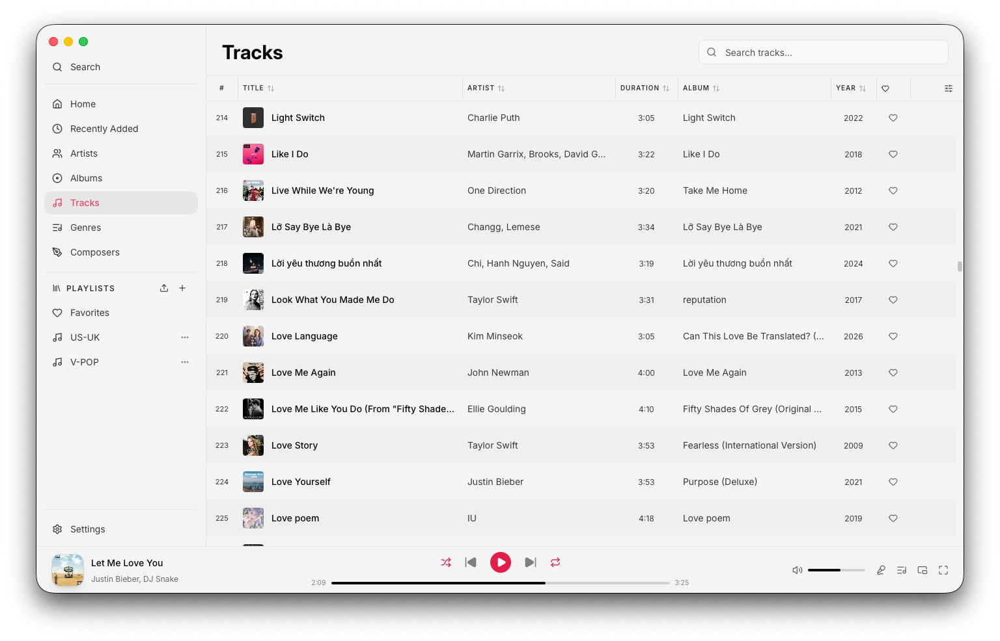
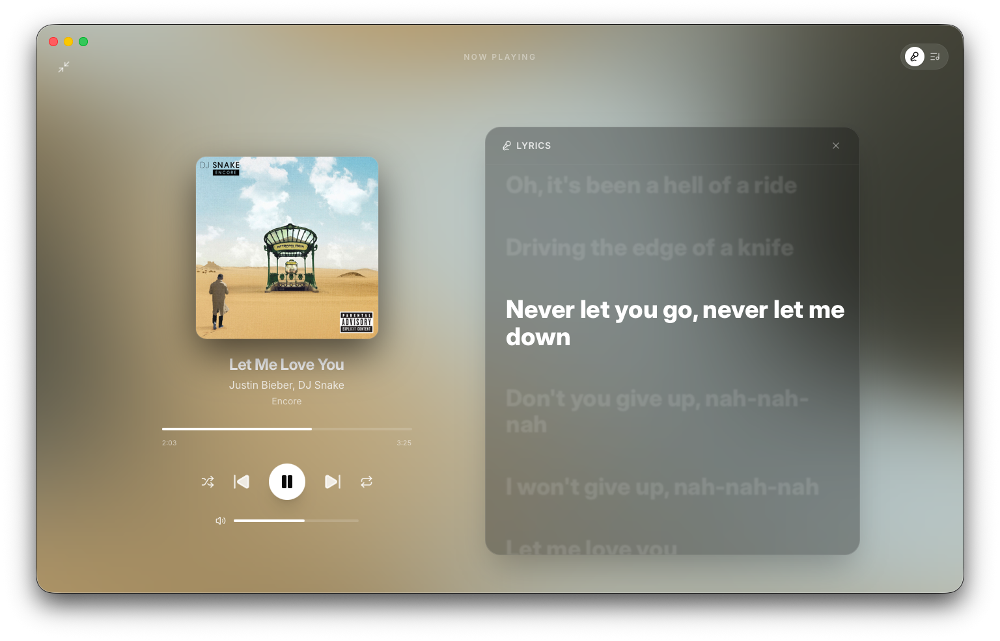

<div align="center">


# Airmedy

**All in one offline music player.**

[](LICENSE)
[](https://go.dev)
[](https://wails.io/)
[](https://last.fm/)
[](https://github.com/thanhvc198/airmedy/actions)

[](https://airmedy.netlify.app)
[](https://airmedy.netlify.app)
[](https://airmedy.netlify.app)

[](https://airmedy.netlify.app)
[](https://github.com/thanhvc198/airmedy/releases/latest)

</div>

---

<div align="center">


</div>

---

## Features

- **Your whole library** — add any folder and Airmedy scans it instantly, even with tens of thousands of tracks.
- **Lyrics that follow along** — synced lyrics scroll line-by-line as the song plays. Plain-text lyrics shown when sync data isn't available. Supports both embedded lyrics and online lyrics from LRCLIB and Kugou.
- **Fullscreen & miniplayer modes** — go fullscreen for an immersive listening experience, or shrink to a miniplayer that stays out of your way.
- **Playlists** — create and manage playlists, import and export them, and browse your collection by genre, artist, or album.
- **Gapless playback** — tracks transition without any silence or interruption.
- **10-band equalizer** — tune the sound to your headphones or speakers. Runs natively on macOS (SFBAudioEngine) and Windows/Linux (miniaudio) for optimal performance.
- **Lock screen & media keys** — control playback from your keyboard, lock screen, or Control Center — just like a first-party app.
- **Last.fm scrobbling** — sync your listening history and loved tracks automatically.
- **Fast search** — find any track, album, or artist in milliseconds.
- **Metadata editor** — update track titles, artists, albums, and other tags. Support for updating album artwork with automatic JPEG conversion.
- **Plays in the background** — close the window and music keeps going. Quit when you actually mean it.
- **Tray menu** — control playback from the system tray.
- **Themes** — light, dark (gray), and black (pure black for OLED screens) themes.
- **Online Artist Arts** — fetch and display artist arts from Deezer.

## Audio Format Support

| Format               | macOS | Windows | Linux |
| -------------------- | :---: | :-----: | :---: |
| MP3                  |  ✅   |   ✅    |  ✅   |
| AAC / M4A / ALAC     |  ✅   |   ✅    |  ✅   |
| FLAC                 |  ✅   |   ✅    |  ✅   |
| WAV / AIFF           |  ✅   |   ✅    |  ✅   |
| Ogg Vorbis           |  ✅   |   ✅    |  ✅   |
| Opus                 |  ✅   |   ✅    |  ✅   |
| APE (Monkey's Audio) |  ✅   |   ✅    |  ✅   |
| WavPack              |  ✅   |   ✅    |  ✅   |
| DSD / DSF / DFF      |  ✅   |   ✅    |  ✅   |

---

On macOS, playback runs through **SFBAudioEngine** — a powerful, high-performance audio engine that provides native support for almost every format without needing FFmpeg. On Windows and Linux, **miniaudio** provides high-performance audio output, while **FFmpeg** serves as the universal decoding backend for all supported formats, ensuring consistent and robust playback across the entire library.

```
┌─────────────────────────────────────────────────────────┐
│                      Airmedy Core                       │
│                                                         │
│   ┌─────────────────┐       ┌──────────────────────┐    │
│   │    macOS Path   │       │ Windows / Linux Path │    │
│   │                 │       │                      │    │
│   │  SFBAudioEngine │       │      miniaudio       │    │
│   │  (All Formats)  │       │   (output engine)    │    │
│   └────────┬────────┘       └───────────┬──────────┘    │
│            │                            │               │
│            │                 ┌──────────┴──────────┐    │
│            │                 │    FFmpeg Decoder   │    │
│            │                 │    (All Formats)    │    │
│            │                 └──────────┬──────────┘    │
│            │                            │               │
│            └──────────────┬─────────────┘               │
│                           │                             │
│                Consistent Audio Stream                  │
│                    (Float32 PCM)                        │
└─────────────────────────────────────────────────────────┘
```

The FFmpeg libraries are statically compiled and bundled inside `internal/infra/audio/ffmpeg_libs/`. No system FFmpeg installation is ever required.

---

## Tech Stack

| Layer                | Technology                |
| -------------------- | ------------------------- |
| Backend runtime      | Go 1.25, Wails v3         |
| Dependency injection | uber-go/fx                |
| Database             | SQLite via golang-migrate |
| Search index         | Bleve                     |
| File watching        | fsnotify                  |
| Audio (macOS)        | SFBAudioEngine + CGo      |
| Audio (Win/Linux)    | miniaudio + FFmpeg (CGo)  |
| Metadata             | go-taglib                 |
| Frontend framework   | Vue 3 (Composition API)   |
| State management     | Pinia                     |
| UI components        | ShadCN-vue + Tailwind CSS |
| Lyrics               | LRCLIB API                |

---

## Architecture

Airmedy follows a **Hexagonal / Ports & Adapters** pattern:

```
cmd/
└── main.go                  # Entry point

internal/
├── domain/                  # Business logic, interfaces, DTOs
├── app/                     # Application services (use cases)
└── infra/
    ├── audio/               # SFBAudioEngine / miniaudio / FFmpeg adapters
    ├── db/                  # SQLite migrations and queries
    ├── search/              # Bleve index adapter
    └── wails/               # Thin Wails bindings (frontend ↔ app)

frontend/
├── src/
│   ├── components/          # Feature components (AlbumCard, TrackTable…)
│   │   └── ui/              # Stateless UI primitives (Button, Slider…)
│   ├── views/               # Route-level pages
│   ├── stores/              # Pinia stores
│   ├── composables/         # Shared logic
│   └── locales/             # i18n locale files
```

Dependencies always point inward — `infra` depends on `app`, `app` depends on `domain`, never the reverse.

---

## Building from Source

### Prerequisites

| Tool         | Version                                                    |
| ------------ | ---------------------------------------------------------- |
| Go           | ≥ 1.25                                                     |
| Node.js      | ≥ 20                                                       |
| pnpm         | ≥ 9                                                        |
| Task         | [taskfile.dev](https://taskfile.dev)                       |
| Wails CLI v3 | `go install github.com/wailsapp/wails/v3/cmd/wails@latest` |

> **No system FFmpeg required.** Pre-built static libraries for `darwin/amd64`, `darwin/arm64`, `windows/amd64`, `linux/amd64`, and `linux/arm64` are bundled in `internal/infra/audio/ffmpeg_libs/`.

### Clone & Run

```bash
git clone https://github.com/thanhvc198/airmedy.git
cd airmedy

# Run in development mode
wails3 dev

# Build production binary
wails3 build
```

### Verify

```bash
wails3 task verify   # runs all Go unit tests + Vue component tests + linters
```

### Run task

```bash
wails3 task {task_name}
```

---

## Roadmap

- [ ] **Smart Playlists** — rule-based auto-playlists (genre, BPM, play count)
- [ ] **AirPlay 2** — stream to any AirPlay speaker or Apple TV directly from Airmedy.

---

## Contributing

1. Fork the repo and create a feature branch
2. Follow [Conventional Commits](https://www.conventionalcommits.org/) — enforced by the `commit-msg` hook (`wails3 task setup:hooks`)
3. All new features and bug fixes require accompanying tests
4. Open a pull request against `master`

---

## License

MIT © [misa198](https://github.com/misa198)

---
